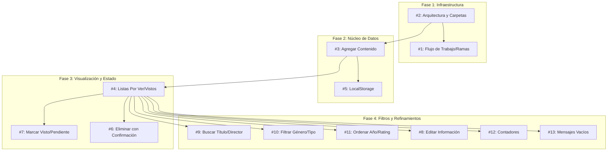

# Análisis de Interdependencias y Asignación de Issues

Este documento detalla la estructura lógica del proyecto, las dependencias entre Historias de Usuario (US) y una propuesta de distribución para un equipo de 3 personas.

## 1. Mapa de Interdependencias

El desarrollo se divide en cuatro fases lógicas donde cada nivel depende de la estabilidad del anterior.

---

## 2. Propuesta de Asignación (Equipo de 3)

Para minimizar bloqueos, se han agrupado las tareas en tres perfiles funcionales.

### 👤 Persona A: Arquitectura y Entrada de Datos (El "Arquitecto")
Responsable de la estructura base, el ingreso de información y la persistencia.
*   **#2 (US1):** Configuración de carpetas y arquitectura base. **[BLOQUEANTE INICIAL]**
*   **#3 (US2):** Formulario de alta de películas/series.
*   **#5 (US11):** Lógica de persistencia en `localStorage`.
*   **#13 (US12):** Estados de carga y mensajes de listas vacías.

### 👤 Persona B: Visualización y Gestión de Listas (El "Listero")
Responsable de mostrar los datos y las acciones directas sobre los ítems.
*   **#4 (US3):** Renderizado de las listas "Por Ver" y "Vistos".
*   **#7 (US4):** Lógica de cambio de estado (Toggle Visto/Pendiente).
*   **#6 (US6):** Funcionalidad de eliminación con modal de confirmación.
*   **#12 (US10):** Implementación de contadores dinámicos por género y lista.

### 👤 Persona C: Manipulación Avanzada y Edición (El "Optimizador")
Responsable de la experiencia de usuario avanzada y mantenimiento de datos.
*   **#9 (US7):** Barra de búsqueda reactiva por título o director.
*   **#10 (US8):** Selects de filtrado por género y tipo.
*   **#11 (US9):** Lógica de ordenamiento (Ascendente/Descendente).
*   **#8 (US5):** Formulario de edición (Reutilizando componentes de la Persona A).

---

## 3. Puntos de Sincronización Críticos

1.  **Modelo de Datos:** La Persona A debe definir la interfaz del objeto `MediaItem` (id, title, director, year, genre, rating, type, isWatched) antes de que las Personas B y C avancen demasiado.
2.  **Rutas y Carpetas:** Nadie debe crear carpetas fuera de la estructura definida por la Persona A en la **US1**.
3.  **Componentes Compartidos:** El formulario de la **US2** (Persona A) y la **US5** (Persona C) deben ser preferentemente el mismo componente parametrizado para evitar duplicación de código.
